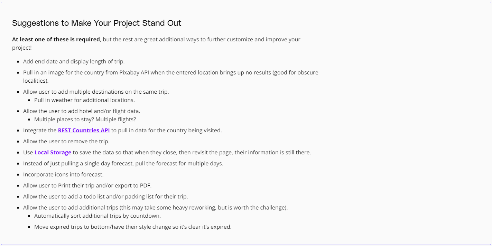

# Prologue
- Travel app is application that is written in vanilla Javascript, HTML, SCSS with some data is called from third party. I would recommend you to go through this project and have a glance at for this application

# Introduction
- This project is a combination from previous four lesson with different technology. As it can say, **travel app** have fully technology from Udacity course

### HTML, CSS: 
 - Of course, it should be present as a required needed to build user interface on the browser. UI is simple, it has 2 input: one for typing country you want to travel, one for date you will depart (maybe the date is now)
### JS: 
  - JS is a crucial part to build perfect application. It is used in order to create dynamic content. After clicking button submit, serios of APIs will be called, it aims to return data and you will difference UI given on the date you type
  - API include 3 part. This is an available one. My task is get API key for each API and binding corresponding data as a body call for each API. API will define in the next part
### Webpack:
  - Webpack is used in order to bundle minification, associate with service workers for offine functionality
### Jest:
  - A framework used to unit test for function that I wrote in `src/client/js/***.js`. You can start your testing with npm run test

# Initial this project
 After you pulling, download the source code, open source code in particular IDE. You proceed run the following steps:
 1. Open terminal and type 
 ```npm i``` to install all packages for node_modules. All the library in this package is coming from **package.json**
 2. *(Optional)* you can run ```npm run build-dev``` for webpack in local dev environment.
 3. ```npm run build-prod``` for create a distribution folder. It will bundle all the *.html*, *.scss*, *js/.js* into specialized file
 4. ```npm run start``` to conduct run server at port 8000. Please open the browser and type `http://localhost:8000/` to use functionality

# API
 API use in the application include 3 API
 1. **GeoNamesAPI**: After you click button, it gets country value, parse into API, API return serios data, it have lat, lon
 2. **Weatherbit**: The next step is lat, lon is used in order to pass as an argument into this API to get data about weather based on the country
 3. **Pixabay**: Depend on country, it get an country's image

## About this project
This project is extendable, The requirement for this task contain the below image:

